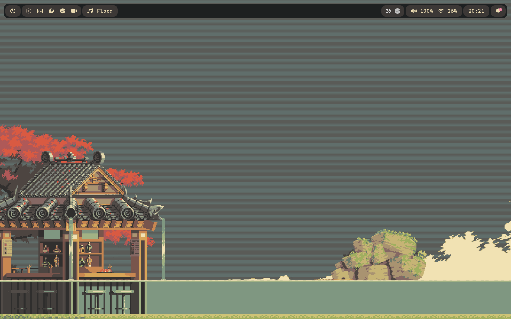

  
  <h1>dotfiles</h1>
  This is where I keep my dotfiles for my setup! Feel free to check them out.

  <h2>Software I Use</h2>

> [!IMPORTANT]
> Before using `.zshrc` config file, install `fzf`, `zoxide` and `ohmyposh`.

- OS: [Fedora 40](https://fedoraproject.org/)
- Shell: [zsh](https://github.com/ohmyzsh/ohmyzsh/wiki/Installing-ZSH) (with [zinit](https://github.com/zdharma-continuum/zinit) + [ohmyposh](https://ohmyposh.dev/))
- Terminal: [Kitty](https://sw.kovidgoyal.net/kitty/)
- Code Editor: [VS Code](https://code.visualstudio.com/) / [NeoVim](https://neovim.io/) (with [LazyVim](https://www.lazyvim.org/))
- WM: [Hyprland](https://github.com/hyprwm/Hyprland) 
- Status Bar: [Waybar](https://github.com/Alexays/Waybar)
- Launcher: [Rofi](https://github.com/davatorium/rofi)
- Notification Center: [swaync](https://github.com/ErikReider/SwayNotificationCenter)

  <h2>Look & Feel</h2>

- Font: [CaskaydiaCove Nerd Font](https://www.nerdfonts.com/)
- Cursor: [Bibata Modern Clasic](https://github.com/ful1e5/Bibata_Cursor)
- Icons: [Papirus Icon Theme](https://github.com/PapirusDevelopmentTeam/papirus-icon-theme)
- Colorscheme: [Gruvbox](https://github.com/morhetz/gruvbox)
